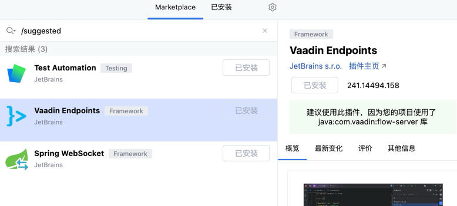

# 针对 Java 程序员的前端开发总览

这个演讲主要讨论了Spring开发者如何应对前端开发的多样性和快速变化:

1. 主要依赖 Java 的框架:
    - Spring MVC 配合 Thymeleaf 等模板引擎
    - Vaadin 提供纯 Java 开发 UI 的方案

2. JavaScript 生态:
    - 包管理器: NPM, Yarn, PNPM 等
    - 构建工具: Vite 等新工具提升开发体验
    - 运行时: Node.js, Deno, Bun 等

3. JavaScript框架:
    - React, Vue, Angular 等主流框架各有特色
    - 介绍了如何在 Spring Boot 项目中集成 Vue.js

4. HTMX:
    - 通过HTML属性实现动态交互,无需编写 JavaScript
    - 适合简单的动态需求

# 我对于 Vaadin 比较感兴趣

Vaadin 官网: [https://vaadin.com/](https://vaadin.com/)

可以下载示例项目，在 IDEA 中开发还建议安装如下插件：

更加注重后端的 Java 开发者可能会更加喜欢 Vaadin。Vaadin 目前也非常成熟，配套的开发工具很多，尤其是在 UI 设计方面。可以直接 Figma 生成，也可以直接使用 Vaadin 的设计器，地址是 [https://vaadin.com/designer](https://vaadin.com/designer)。

但是 Vaadin 仅仅适合做管理后台的项目，主要因为纯 Java 开发，所有本来是 JavaScript 的逻辑也交给服务端执行了，服务端压力会比较大。对于一些复杂的前端交互，无论是性能还是成本，还是需要使用 Vue.js 或者 React 等框架。